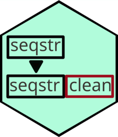

<!-- README.md is generated from README.Rmd. Please edit that file -->

# seqstrclean <a href="https://rachelesrogers.github.io/seqstrclean/"></a>

<!-- badges: start -->
<!-- badges: end -->

The goal of seqstrclean is to clean sequential strings. In cumulative
note taking, notes from a previous section may be saved alongside notes
from the current section. This package aims to remove the previous
section’s notes, leaving only notes from the current section. For
example, a person may take the note: “A cat ran up a tree.” initially,
then add “The cat was chased by a dog”. The notepad would then show: “A
cat ran up a tree. The cat was chased by a dog”. This package is meant
to separate the notes into the two parts based on the different saves of
the notepad.

The firstnchar function compares the beginning of the latest notes to
the previous section, and removes from the latest notes if they are
similar enough (determined by edit distance).

The lcsclean function compares the entirety of both note sheets and
locates the longest common substring between the two, which is removed
from the latest note sheet if it represents a significant portion of the
previous notes.

## Installation

You can install the development version of seqstrclean from
[GitHub](https://github.com/) with:

``` r
# install.packages("devtools")
devtools::install_github("rachelesrogers/seqstrclean")
```

## Example

There are three methods used for sequential note cleaning in this
package: First N Character, Longest Common Substring, and a hybrid
method combining the two. The First N Character method is faster, while
in a small verification study the Longest Common Substring method was
more accurate. The hybrid method strikes a balance between the speed of
the First N Character method and the accuracy of the Longest Common
Substring method by only applying the Longest Common Substring method to
difficult cases (where previous text cannot be removed using the First N
Character method, or the supplied note sheet is unusually long).

### First N Character Method

The first method is the First N Character method, where the entirety of
the previous page’s notes are compared with the first n characters of
the current page’s notes (where n is the length of the previous page’s
notes). If the notes are similar enough (based on edit distance), the
first n characters will be removed from the current page.

``` r
library(seqstrclean)

test_dataset <- data.frame(ID=c("1","1","2","2","1", "3", "3"),
Notes=c("The","The cat","The","The dog","The cat ran", "the chicken was chased", "The goat chased the chicken"),
Page=c(1,2,1,2,3,1,2))

test_dataset
#>   ID                       Notes Page
#> 1  1                         The    1
#> 2  1                     The cat    2
#> 3  2                         The    1
#> 4  2                     The dog    2
#> 5  1                 The cat ran    3
#> 6  3      the chicken was chased    1
#> 7  3 The goat chased the chicken    2
```

In the test dataset shown above, there are third note-takes (identified
by ID number), and 2-3 pages of notes. The first individual wrote “The”,
“cat”, and “ran” sequentially on their notes, with one word per page.
The second individual wrote “The” and “dog” sequentially. The third
individual wrote “the chicken was chased” on the first page, and “The
goat chased the chicken” on the second page, which does not reflect
sequential note-taking. The First N Character method can be used to
separate these notes, based on what was written per page.

``` r

firstnchar(dataset=test_dataset,notes="Notes",char_diff=3,identifier="ID",pageid="Page")
#>   ID                       Notes Page                  page_notes edit_distance
#> 1  1                         The    1                         The            NA
#> 2  1                     The cat    2                         cat             0
#> 3  2                         The    1                         The            NA
#> 4  2                     The dog    2                         dog             0
#> 5  1                 The cat ran    3                         ran             0
#> 6  3      the chicken was chased    1      the chicken was chased            NA
#> 7  3 The goat chased the chicken    2 The goat chased the chicken            17
```

Here, page_notes displays the clean notes, and edit_distance refers to
the distance between the previous page of notes and the first n
character of the current page of notes. In the cases of sequential notes
(for individuals 1 and 2), the edit distance is 0, as the beginning of
the notes match the previous page’s notes. In the case of the third
individual, the edit distance is 4 (there are four substitutions
necessary to change from “goat” to “chick”), which is greater than the
set threshold of 3. Thus, the second page of the third individual’s
notes include the full text recorded on the second page (nothing was
removed).

### Longest Common Substring Method

The second method is the Longest Common Substring method, where the two
page note strings are compared in their entirity for the longest string
they have in common, above a certain threshold. This longest string is
then removed from the current page of notes, and the process is repeated
until the longest common substring is no longer above the assigned
cutoff.

``` r
test_dataset <- data.frame(ID=c("1","1","2","2","1", "3", "3"),
Notes=c("The","The cat","The","The dog","The cat ran", "the chicken was chased", "The goat chased the chicken"),
Page=c(1,2,1,2,3,1,2))
```

The dataset above is the same as that of the First N Character method,
aside from the third notetaker. In this case, the third notetaker wrote
“the chicken was chased” on the first page, and “The goat chased the
chicken” on the second page.

``` r
lcsclean(test_dataset,"Notes",0.5,"ID","Page")
#>   ID                       Notes Page                  page_notes
#> 1  1                         The    1                         The
#> 2  1                     The cat    2                         cat
#> 3  2                         The    1                         The
#> 4  2                     The dog    2                         dog
#> 5  1                 The cat ran    3                         ran
#> 6  3      the chicken was chased    1      the chicken was chased
#> 7  3 The goat chased the chicken    2 The goat chased the chicken
```

When the proportion threshold is set to 0.5, nothing is removed from the
third note taker’s second page, as the longest common substring (“the
chicken”) represents exactly half of the characters in the page.

``` r
lcsclean(test_dataset,"Notes",0.49,"ID","Page")
#>   ID                       Notes Page             page_notes
#> 1  1                         The    1                    The
#> 2  1                     The cat    2                    cat
#> 3  2                         The    1                    The
#> 4  2                     The dog    2                    dog
#> 5  1                 The cat ran    3                    ran
#> 6  3      the chicken was chased    1 the chicken was chased
#> 7  3 The goat chased the chicken    2       The goat chased
```

When the threshold is lowered to 0.49, “the chicken” is removed from the
second page of notes. This would represent the removal of the longest
common substring after one iteration, as the next longest substring
(“chased”) does is below the cutoff threshold.

``` r
lcsclean(test_dataset,"Notes",0.25,"ID","Page")
#>   ID                       Notes Page             page_notes
#> 1  1                         The    1                    The
#> 2  1                     The cat    2                    cat
#> 3  2                         The    1                    The
#> 4  2                     The dog    2                    dog
#> 5  1                 The cat ran    3                    ran
#> 6  3      the chicken was chased    1 the chicken was chased
#> 7  3 The goat chased the chicken    2              The goat
```

However, if the threshold is reduced further to 0.25 (or 1/4 of the
previous notes), “chased” will be removed from the second page of notes
as well, leaving only “the goat” in the clean notes.

## Acknowledgements

This work was funded (or partially funded) by the Center for Statistics
and Applications in Forensic Evidence (CSAFE) through Cooperative
Agreements 70NANB15H176 and 70NANB20H019 between NIST and Iowa State
University, which includes activities carried out at Carnegie Mellon
University, Duke University, University of California Irvine, University
of Virginia, West Virginia University, University of Pennsylvania,
Swarthmore College and University of Nebraska, Lincoln.
